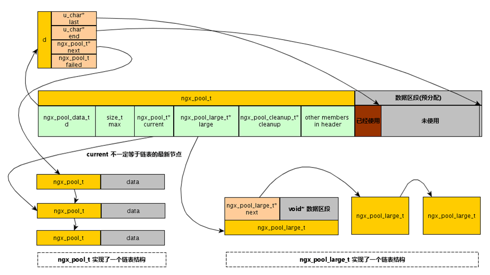

最近对Nginx进行了一些简单的剖析，要是剖析的不好希望大家见谅，本人水平有限哦

我们先看这么一副图



在调用这个图片之前我想先首先声明一下这幅图的作者啊，我可不想打着盗版的声音去用这幅图哦=   =！！！感谢这幅图的作者rainx！

好，下面我们来通过这个图来对整个内存池进行分析吧。
我们通过代码的对比来分析这幅图

```c++
//内存池头部结构 
struct ngx_pool_s {
    ngx_pool_data_t       d;//对线程块的一个管理
    size_t                max;//最大值
    ngx_pool_t           *current;//当前指针指的是哪个内存块
    ngx_chain_t          *chain;
    ngx_pool_large_t     *large;//大块内存
    ngx_pool_cleanup_t   *cleanup;//清除某些特殊数据
    ngx_log_t            *log;
};
```

其实我觉得我们先应该通过这个结构体和这幅图来了解一下nginx内存池，其实所谓的一个内存池是通过一个链表来进行管理的，而ngx_pool_t就是对一个节点进行管理的结构体。

```
ngx_pool_data_t  d  //这是对这一块ngx_pool_t的数据块的一个管理
size_t  max  //数据块的大小，也就是你所分配的这一块节点数据区域的大小
ngx_pool_t  *current  //当前可分配的ngx_pool_t
ngx_pool_large_t     *large  //大于max的用大块内存区域存储
ngx_pool_cleanup_t   *cleanup  //用于清除某些文件描述符或者其它的特殊结构
```

```c++
typedef struct {
    u_char               *last;//当前内存池分配到此处，即下一次分配从此处开始
    u_char               *end;//内存池结束位置
    ngx_pool_t           *next;//内存池里面有很多块内存，这些内存   
                               //块就是通过该指针连成链表的 
    ngx_uint_t            failed;//内存池分配失败次数
} ngx_pool_data_t;
```

```
u_char  *last  //指向可以分配内存空间的地方，last实际上是作为已经分配的内存空间的末尾，而下一次数据分配就要从last开始到end，当然要是在分配的空间小于max的情况下，假如下一次所要求分配的空间大于max，那么则开辟大块内存
u_char  *end  //数据域最末尾的指针
ngx_pool_t  *next  //指向下一块ngx_pool_t，这是在内存分配不够，开辟了下一个ngx_pool_t的前提下
ngx_uint_t  failed  //假如我们的分配的内存空间过于的小，超过4次在此块ngx_pool_t分配不成功，那么我们的current就会指向下一个ngx_pool_t，这个就是记录失败次数的一个记录器
```

```
//管理大块内存
struct ngx_pool_large_s {
    ngx_pool_large_t     *next;//下一块
    void                 *alloc;
};
```
我们在这里强调一下，大块内存实际上是指在ngx_pool_t中大于max的需要分配的节点，当然每次分配都是在current节点中，ngx_pool_t中的large指针负责将这些节点串联起来
void  *alloc  //当然指的就是大块内存的分配区域

```
struct ngx_pool_cleanup_s {
    ngx_pool_cleanup_pt   handler;//处理特殊数据的回调函数
    void                 *data;//指向要清除的数据
    ngx_pool_cleanup_t   *next;//下一个cleanup callback  
};

```
当然我想说这个结构体没啥好介绍的，当我们在内存池中加入打开了些文件描述符在释放前需要关闭这些文件描述符或者一些特殊结构需要释放的时候，我们会调用**ngx\_pool\_cleanup\_s**中的**handler**函数，当然这也是一个节点，我们需要在处理这些特殊的结构或者文件描述符的时候用特定的回调函数handler，我们需要把这些handler串联起来，其实跟ngx\_pool\_large\_s差不多，也是在当前的current下，而串联起来这些节点的是cleanup指针

------------------------------------------------

好啦，我能说nginx中内存池大致的结构我已经剖析完了，现在我们来分析一些对它的操作的函数:

```c++
void *ngx_alloc(size_t size, ngx_log_t *log);
void *ngx_calloc(size_t size, ngx_log_t *log);

ngx_pool_t *ngx_create_pool(size_t size, ngx_log_t *log);
void ngx_destroy_pool(ngx_pool_t *pool);
void ngx_reset_pool(ngx_pool_t *pool);

void *ngx_palloc(ngx_pool_t *pool, size_t size);
void *ngx_pnalloc(ngx_pool_t *pool, size_t size);
void *ngx_pcalloc(ngx_pool_t *pool, size_t size);
void *ngx_pmemalign(ngx_pool_t *pool, size_t size, size_t alignment);
```

咱们来一个个分析好吧:

```c++
void *
ngx_alloc(size_t size, ngx_log_t *log)
{
    void  *p;
//可以看出来底层调用了malloc
    p = malloc(size);
    if (p == NULL) {
        ngx_log_error(NGX_LOG_EMERG, log, ngx_errno,
                      "malloc(%uz) failed", size);
    }

    ngx_log_debug2(NGX_LOG_DEBUG_ALLOC, log, 0, "malloc: %p:%uz", p, size);

    return p;
}
```

**ngx_alloc**我们可以把它看成一个底层调用函数，直接调用的malloc，当然这里是看起来跟内存池没有任何关系了，但是它应该算是内存池的底层调用函数

-------------------------

```c++
void *
ngx_calloc(size_t size, ngx_log_t *log)
{
    void  *p;
//带清零作用的
    p = ngx_alloc(size, log);

    if (p) {
        ngx_memzero(p, size);
    }

    return p;
}
```

这里当然也是相当于一个底层调用函数，它只不过相当于从堆上分配了一块内存附带清零的作用，仅此而已

-----------------

```
ngx_pool_t *
ngx_create_pool(size_t size, ngx_log_t *log)
{
    ngx_pool_t  *p;

    p = ngx_memalign(NGX_POOL_ALIGNMENT, size, log);
    if (p == NULL) {
        return NULL;
    }

    p->d.last = (u_char *) p + sizeof(ngx_pool_t);
    p->d.end = (u_char *) p + size;
    p->d.next = NULL;
    p->d.failed = 0;

    size = size - sizeof(ngx_pool_t);
    p->max = (size < NGX_MAX_ALLOC_FROM_POOL) ? size : NGX_MAX_ALLOC_FROM_POOL;

    p->current = p;
    p->chain = NULL;
    p->large = NULL;
    p->cleanup = NULL;
    p->log = log;

    return p;
}
```

诶嘿，这里就很奇怪啊，貌似没有用到上面的ngx_alloc()函数啊，不过没关系，我只能说它其实并没有调用ngx_alloc()这个接口，而它调用了另一个接口:

```
p = ngx_memalign(NGX_POOL_ALIGNMENT, size, log);
```

我们可以看到这个接口和上面的接口都不一样，那么可以进这个接口里面去看一下:
	

```c++
void *
ngx_memalign(size_t alignment, size_t size, ngx_log_t *log)
{
    void  *p;
    int    err;
//调用posix_memalign( )成功时会返回size字节的动态内存
//并且这块内存的地址是alignment的倍数
//参数alignment必须是2的幂，还是void指针的大小的倍数
    err = posix_memalign(&p, alignment, size);
    //...
return p;
}
```

它里面涵盖了一个叫做**posix_memalign(&p, alignment, size)**的函数，那么这个函数的作用是干嘛的呢？我们知道POSIX标明了通过**malloc(), calloc(), 和 realloc()**返回的地址对于任何的C类型来说都是对齐的。在Linux中，这些函数返回的地址在32位系统是以8字节为边界对齐，在64位系统是以16字节为边界对齐的,而**posix_memalign(&p, alignment, size)**的作用就是动态对齐。而在这里它则是按alignment大小来进行对齐的，其实也可以看一下这个玩意的大小吧:

```
#define NGX_POOL_ALIGNMENT       16*
```

嘿嘿，看到没有，它的大小是16哦！！！也就是说它是按16来进行对齐的，至于具体的posix_memalign(&p, alignment, size)咋用，希望大家自己回去查一下吧。
	
当然我们也看过了ngx_memalign(...)函数，我们继续来看一下ngx\_create\_pool(...)函数，我们可以看到它对max进行了一个初始化:

```
p->max = (size < NGX_MAX_ALLOC_FROM_POOL) ? size : NGX_MAX_ALLOC_FROM_POOL;
```

其实我一直很好奇这个地方啊，这个地方的max是经过传进来的值决定的，而假如，传进来的小于NGX_MAX_ALLOC_FROM_POOL，那么按size的大小来计算哦，这里我们再来顺带看一下NGX_MAX_ALLOC_FROM_POOL是什么:
**#define NGX_MAX_ALLOC_FROM_POOL  (ngx_pagesize - 1)**

对哦，这里是一个宏定义，定义的大小是4K-1个大小，那么我们姑且算在小于4K的情况下它按size大小来定义吧，其实我认为这里的唯一的好处就是它按分页机制去处理了一个最大内存，假如我不到4K我能节约性的从内存中拿合适的内存，当大于4K的时候我们就可以不考虑页面大小的问题了，直接就大块内存走起，当然，考不考虑4K不是我们说了算，而是刚开始申请的size大小说了算哦。

我一直觉得这个地方有个BUG，那就是假如传进来的size < sizeof(ngx_pool_t)怎么办？不就成负数了？那么这个进程会不会因此挂掉？这个我就是不是很清楚了！！

----------------

接下来看看```ngx_destroy_pool(ngx_pool_t *pool)```

```c++
void ngx_destroy_pool(ngx_pool_t *pool)
{
    ngx_pool_t          *p, *n;
    ngx_pool_large_t    *l;
    ngx_pool_cleanup_t  *c;

//先考虑cleanup函数，但是貌似我并没有找见有关的回调
    for (c = pool->cleanup; c; c = c->next) {
        if (c->handler) {
            ngx_log_debug1(NGX_LOG_DEBUG_ALLOC, pool->log, 0,
                           "run cleanup: %p", c);
            c->handler(c->data);
        }
    }

    for (l = pool->large; l; l = l->next) {

        ngx_log_debug1(NGX_LOG_DEBUG_ALLOC, pool->log, 0, "free: %p", l->alloc);

        if (l->alloc) {
            ngx_free(l->alloc);
        }
    }
    //....
        for (p = pool, n = pool->d.next; /* void */; p = n, n = n->d.next) {
        ngx_free(p);

        if (n == NULL) {
            break;
        }
    }
}
```

我们可以从这里看到它先调用了ngx_pool_t中的clean中的handler函数来清理一些它可能打开的文件描述符或者特殊结构，此时再free掉那些大块结构。当然，最后是把自己本身的节点给free掉了

--------------------

**void ngx\_reset\_pool(ngx\_pool\_t *pool)**

```c++
void
ngx_reset_pool(ngx_pool_t *pool)
{
    ngx_pool_t        *p;
    ngx_pool_large_t  *l;

    for (l = pool->large; l; l = l->next) {
        if (l->alloc) {
            ngx_free(l->alloc);
        }
    }

    for (p = pool; p; p = p->d.next) {
        p->d.last = (u_char *) p + sizeof(ngx_pool_t);
        p->d.failed = 0;
    }

    pool->current = pool;
    pool->chain = NULL;
    pool->large = NULL;
}
```

这个函数呢是内存池重置函数，它会将大块内存删掉并且把里面的东西给初始化哦！！

------------

下面说的就是**void *ngx\_palloc(ngx\_pool_t *pool, size\_t size)**了吧

```c++
void * ngx_palloc(ngx_pool_t *pool, size_t size)
{
    u_char      *m;
    ngx_pool_t  *p;

    if (size <= pool->max) {

        p = pool->current;

        do {
            m = ngx_align_ptr(p->d.last, NGX_ALIGNMENT);

            if ((size_t) (p->d.end - m) >= size) {
                p->d.last = m + size;

                return m;
            }

            p = p->d.next;

        } while (p);

        return ngx_palloc_block(pool, size);
    }

    return ngx_palloc_large(pool, size);
}
```
我们可以看到这里是从内存池中分配内存的一个函数，当我们前面创建好内存池之后，我们可以通过这里在一个ngx_pool_t中的数据段中分配节点，我们可以看到，它就只用了last和end两个标记位去标记剩余空间的大小，当我们空间大于max的时候直接用ngx_palloc_large(pool, size)调用大块内存，而假如小于max却在后面的ngx_pool_t中不够用的话则会调用ngx_palloc_block(pool, size)函数，其实内部就是重新申请了一块ngx_pool_t内存，调用的还是ngx_memalign(...)函数，有兴趣的朋友自己看看了。

当然后面还有一个
**void *ngx_pnalloc(ngx_pool_t *pool, size_t size);**
当然，这个函数和**void *ngx_palloc(ngx_pool_t *pool, size_t size)**最大的区别当然就是:
**void *ngx_palloc(ngx_pool_t *pool, size_t size)**是对齐的
**void *ngx_palloc(ngx_pool_t *pool, size_t size)**是不对齐的

----------------

好了总结了那么多，觉得心好累啊！！！