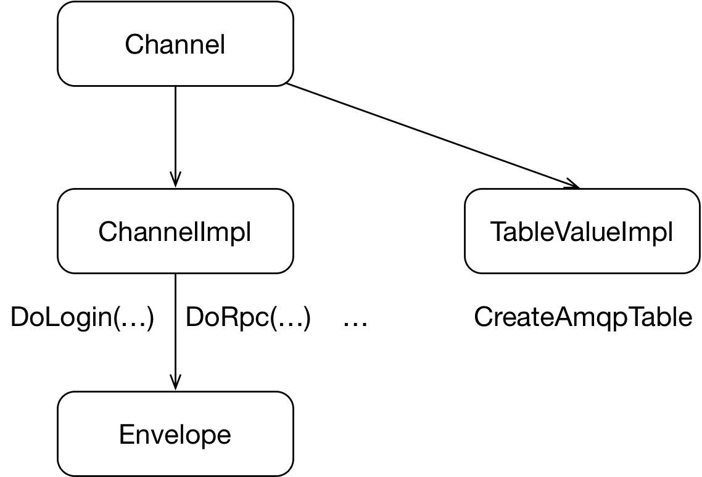

### 背景

SimpleRabbitmqClient是一个对于Rabbitmq的C接口库rabbitmq-c上做的一层封装   

**为什么要封装rabbitmq-c**    

rabbitmq-c是对C的一个接口，它有太多的自己定义的类型，比如我们要往rabbitmq-c的函数中添加一个字符串总要把它变为amqp\_cstring_bytes(...)，rabbitmq-c的一些自定义类型太复杂，而我们根本不需要去关心，我们只需要关心传进去的值和返回的结果。    

SimpleRabbitmqClient做了:     
1、把复杂的rabbitmq-c接口转化成通俗的C++接口   
2、封装了对客户端的连接管理以及错误处理

<!--more-->

### 优点

* 跨平台 兼容Windows和Linux
* 接口多、更灵活、封装了连接管理以及错误处理
* 做了一个对consume的管理

### 框架

### 剖析

#### Channel

对rabbitmq的类型做了一个转换，就是做了一个普通封装，但是没有什么实际操作   

其中包括:    

* 网络连接的判断
* doLogin 、doRpc
(ps: doLogin、doRpc这个直接就是对rabbitmq的操作，只不过这一层封装在ChannelImpl中)

#### ChannelImpl

* 对rabbitmq的一个实际操作，这里面做了很多主要的的工作，就比如:     

1. doLogin     
	实际上就是对登陆的一个封装操作，但是封装的参数相对会多一些，一般好像直接用	amqp_login登陆，他用的是amqp\_login\_with\_properties，也是很用心了
2. doRpc
	对rabbitmq-c操作的一些处理，包括错误处理等
* 对consume的一个管理，建立一个map表，当生成一个consume的时候，注册进map并返回相应的consumeTag(我的理解就是在单线程中有多个consume)
	
#### TableValueImpl

对于amqp\_table\_t的一个对外封装，实际上是自己写的一个Table，主要用于argument，为了能让外部对amqp\_table\_t更好用，所以提供了一个Table，在内部转化为amqp\_table\_t。      
(不过他这个地方倒是又一个很有意思的东西，用了amqp\_pool\_t，这是rabbitmq-c中自带的一个memory pool，用这个生成了一个amqp\_pool\_t。话说回来我实在是看不懂为什么要这么骚操作)

#### Envelope

一个信封，封装了返回的message,我觉得这个我没什么说的，但实际上这个信封对外提供了很多Get的方便的接口，ChannelImpl在接收到生成的消息以后会去调用

#### BasicMessageImpl

这个东西我也是后来剖析完整体框架以后看的吧，所以我也没有把这个画到图里面去   
他的主要功能还是用m\_body封装了返回过来的信息     
我就是想说一下里面用了amqp\_basic\_properties\_t这个结构体很有意思，就是这个结构体好像是rabbitmq-c本身的一个结构体，它相当于提供给用户封装一些userid之类的基本属性，第一次见，所以感觉这个作者应该也是很用心了，把rabbitmq-c这个库封装到极致了

### 总结
我来个人评价一下这个库吧，不喜勿喷:     

* **这个库的封装是极致的**    
对于rabbitmq的封装性来说，我觉得这个库是完美的，极致的，我能说基本上所有的rabbitmq-c的类型使用到了极致，感觉没有什么看漏的吧。(包括**BasicMessage**中有**amqp\_basic\_properties_t**这种类型，我的妈)

* **写法过于中规中矩**    
没有什么特别让人眼前一亮的东西，就是结构很简单吧我觉得，基本没用什么设计模式，所以我感觉看起没什么特别值得剖析的地方，没有对某一块地方拿出来说，但是用起来就很灵活了

* **过于依赖boost**     
很好奇为什么不用C11！ 

其实我想大家对这个库有什么独特的看法也可以来联系我的，我会出剖析