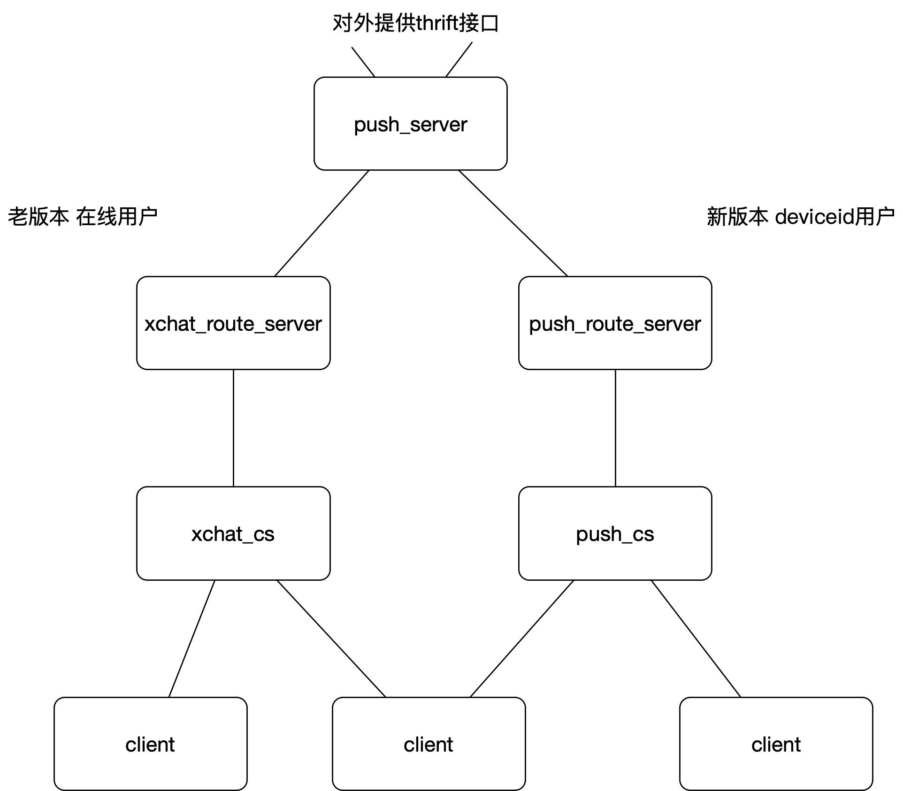

由于最近在对推送系统做设计，所以可能会持续更新哟～！

<!--more-->

* [前言(持续更新)](#前言) 
* [架构设计](#架构设计)
* [功能与接口的设计](#功能与接口的设计)
* [群发与推送之间的异同](#群发与推送之间的异同)
* [群发核心分析](#群发核心分析)

### 前言

群发系统其实和推送系统是很类似的，都是通过服务器这个中间载体向用户大规模的去推发消息，架构是类似的，但是又不是尽完全相同的，本篇文章会对推送和群发的对比，来说明推送框架设计的核心。

### 架构设计



[此处图片暂时省略。。。]

Server服务 --> route --> cs --> client


### 功能与接口的设计

推送所需要的功能是保证在长连接连接上App以后，能及时推送消息到用户手机上，以及做好统计记录，所以这其中有几个点是我们在设计接口时需要考虑的。

* **在给app推送我们需要推送什么样的消息可以做到对业务方进行接耦合，可以让业务方推送各种类型的消息，而推送服务无感知**

这个就是接口设计上面的问题了，在用户发送的时候我们要做到透传，那么接口的设计是只和我们需要推送的消息类型相关，而跟消息的内容无关。所以在设计上我们可以直接考虑简单的设计：

```thrift
struct PushMsg {
    1: required i32 type                    // type是可以自己设定的，主要供给客户端解析业务上特殊的类型        
    2: required string content				// 直接透传，一般content里面的是类似于json的字符串，让业务结构到客户端自己解析
}
```

* **查询需要通过哪几个维度维度发送与查询**
	
我们只对带任务式标志的做记录，不重要的推送不会统计入数据库     
发送时间、版本区间、业务号、userid、token
	
其中token是可以针对单条消息进行查询。

**查询内容：**  

```
目标数(计划推送的目标个数)
有效数(剔除目标数中无效的目标设备后所剩余的个数)
确认到达推送数(推送后台实际下发的目标个数)
点击数(通知栏消息被点击的设备数  客户端埋点)
发送时间
发送速率
版本区间
消息内容
消息token
...
``` 

* **是否需要保证用户发送的频率**

对不同业务的发送者来说，不同的消息可能会有不同的发送频率，有一些消息需要点击打开连接，那么需要控制发送速率稍微小一些，以防发送过多，点击量暴增而增加http服务器端的压力，发送的频率可以是下行无限制，也可以是有限制，由发送者控制发送频率。

* **发送的用户的精准性与个性化推送**

对于，发送者来说，推送的精准化与个性化是推送的必要需求     

推送按用户角度分两类：   

* 对于注册用户的推送
* 对于游客的推送(deviceid推送)

对于功能性角度分两类：

* 个推(单注册用户、单游客)
* 群推(多用户、多游客、在线所有人群发)

### 群发与推送之间的异同

**相同点** :     

1. **架构相同**   
都是 

``` 
								 login_server     
									   |     
									   |     
	Server服务 --> route --> cs --> client 的架构
```

**不同点** :

* **存储性质**    
  * 对于群发：相当于是官方消息发送给每个用户，所以针对必须收到消息的每个用户，每条消息都要存入数据库中，那么就会有批量存入数据库的需求。     
  * 对于推送：同样是发送，并不具体关心，用户是否收到，而是关心发出去消息的情况。所以只需要存一条消息进入数据库，而对于这条消息的发送量则是它关注的，发送目标数、有效数、确认到达数等。

* **频控性质**
  *  对于群发：频率控制的核心在于对数据库的存储，为了不影响数据库的存储而对用户的发送做频控。
  *  对于推送：频率控制的核心在于发送者对于业务的把控。

### 群发核心分析

#### 对于统计的数据

对于推送来说，最重要的是每条消息的数据统计。
我们可以通过架构设计图看到，统计发送总量的部分在cs，那么我们需要从cs把统计到发送用户的数据给返回回来。

#### 有效用户和游客

[分两条线，一条走老的route，一条走新的route]

#### 频控


